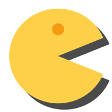

<!DOCTYPE html>
<html lang="de">
  <head>
    
      <meta charset="utf-8">
    <meta http-equiv="X-UA-Compatible" content="IE=edge">
    <meta content="Dipl.-Ing. (FH) Guido Strasser" name="author">
 	<link rel="shortcut icon" type="image/x-icon" href="favicon.ico"> 
 	
    <meta name="viewport" content="width=device-width, initial-scale=1">
    <!-- Die 3 Meta-Tags oben *müssen* zuerst im head stehen; jeglicher sonstiger head-Inhalt muss *nach* diesen Tags kommen -->
    <title>PWA-Apps</title>
    <!-- Bootstrap -->
    <link href="bootstrap.min.css" rel="stylesheet">	
    
  
  <!-- Adsense -->
  

  
  </head>
  
  <body>
  
   <!-- Fixierte Navbar -->
    <nav class="navbar navbar-inverse navbar-fixed-top" style="background-color: #334460; color: #FFFFFF; font-weight: bold; top: 15px;">
      

        

          <button type="button" class="navbar-toggle collapsed" data-toggle="collapse" data-target="#navbar" aria-expanded="false" aria-controls="navbar" style="color: #FFFFFF">
            Navigation ein-/ausblenden
            
            
            
          </button>PWA-Apps&nbsp;  

        

          <ul class="nav navbar-nav">
            <li><a href="index.html" style="color: #FFFFFF">Alle</a></li>                      
            <li class="dropdown">
              <a href="#" class="dropdown-toggle" data-toggle="dropdown" role="button" aria-haspopup="true" aria-expanded="false" style="color: #FFFFFF">PWA's sortieren</a>
              <ul class="dropdown-menu">
                <li><a href="games.html">Games</a></li>
                <li><a href="lernen.html">Lernen</a></li>
                <li><a href="lifestyle.html">Lifestyle</a></li>
				<li><a href="media.html">Media</a></li>				
				<li><a href="tools.html">Tools</a></li>
				<li><a href="other.html">Other</a></li>                
            </ul>			
            </li>
            <li class="dropdown">
              <a href="#" class="dropdown-toggle" data-toggle="dropdown" role="button" aria-haspopup="true" aria-expanded="false" style="color: #FFFFFF">Kontakt</a>
              <ul class="dropdown-menu">
				<li><a href="kontakt.html">Kontakt</a></li>
				<li><a href="agb.html">Unsere AGB</a></li>
			  </ul>
			</li>
			<li class="dropdown">
              <a href="#" class="dropdown-toggle" data-toggle="dropdown" role="button" aria-haspopup="true" aria-expanded="false" style="color: #FFFFFF">PWA's Infos</a>
              <ul class="dropdown-menu">
				<li><a href="pwa.html">Über PWA's</a></li>
				<li><a href="baupwa.html">PWA's bauen</a></li>
			  </ul>
			</li>
          </ul>
        
<!--/.nav-collapse -->
      

    </nav>		
	
	

     

	<h3 style="position: relative; ">Progressive Web Apps (PWA's): Spiele</h3>
	
	
<!-- FePwa -->
<ins class="adsbygoogle"
     style="display:block"
     data-ad-client="ca-pub-8397765882296907"
     data-ad-slot="5528952293"
     data-ad-format="auto"
     data-full-width-responsive="true"></ins>

      	  
	  
        
		  

			
Snakisms

		  <li class="list-group-item" style="text-align: left; font-size: medium">Snakisms als philosophische Abwandlung des Snake Spiels.</li>
		  
		        
        

			
Web Flap

		  <li class="list-group-item" style="text-align: left; font-size: medium">Online Geschicklichkeitsspiel.</li>
		  

		  <!-- Der clearfix wird nur für die benötigte Breite des Ansichtsfensters hinzugefügt -->
				

        

			
Pacman

		  <li class="list-group-item" style="text-align: left; font-size: medium">Das bekannte Spiel online.</li>
		  
		  		  
        

			
Tower Game

		  <li class="list-group-item" style="text-align: left; font-size: medium">PWA Spiel für Häuslebauer.</li>
		  
			  		  
      

	  
	  

	  

			
Google Santa Tracker

		  <li class="list-group-item" style="text-align: left; font-size: medium">PWA zum Thema Weihnachtsmann.</li>
		  

        

			
Sudoku Spiel

		  <li class="list-group-item" style="text-align: left; font-size: medium">Sudoku das bekannte Spiel.</li>
		  
	          
		  <!-- Der clearfix wird nur für die benötigte Breite des Ansichtsfensters hinzugefügt -->
				

		  
        

			
Global Defense

		  <li class="list-group-item" style="text-align: left; font-size: medium">Intergalaktisches Verteidigungsspiel als PWA.</li>
		  
	
		  

			
Quiz Audio

		  <li class="list-group-item" style="text-align: left; font-size: medium">Quiz App für Musikliebhaber.</li>
		  
		  
      

	    
	  
	  

     

	<h3 style="position: relative; ">Diese Seite befindet sich im Aufbau</h3>
      
Hier entsteht ein kostenfreies Portal für Progressive Web Apps (PWA's) !

	  
Stellen Sie ihre PWA in unser Portal.   
	  
	  <a style="text-decoration: none; color: rgb(204, 0, 0);" href="mailto:info@pwa-apps.de?subject=PWA Vorschlag, etc.&body=Bitte Name und Anschrift nicht vergessen.">
	  !! Kontaktieren Sie uns einfach !!</a> 

	  
		  
      

	  
      
	  
Für die in diesem Portal eingestellten PWA's 
	  sind die jeweiligen Softwarehersteller verantwortlich. 
	  

      
Änderungen an unserer Software, Dokumentation und Internetseite behalten wir uns vor. Wir nutzen Google Analytics. 
      Bitte beachten Sie diesbezüglich die Hinweise auf unserer Kontaktseite! &nbsp; 

      
	        		
    <!-- jQuery (wird für Bootstrap JavaScript-Plugins benötigt) -->
    
    <!-- Binde alle kompilierten Plugins zusammen ein (wie hier unten) oder such dir einzelne Dateien nach Bedarf aus -->
    
	
	  
	
  </body>
</html>
