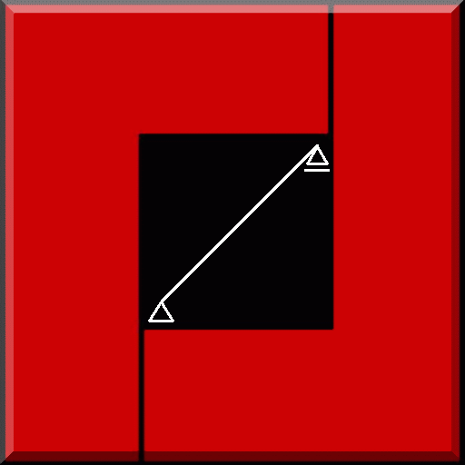
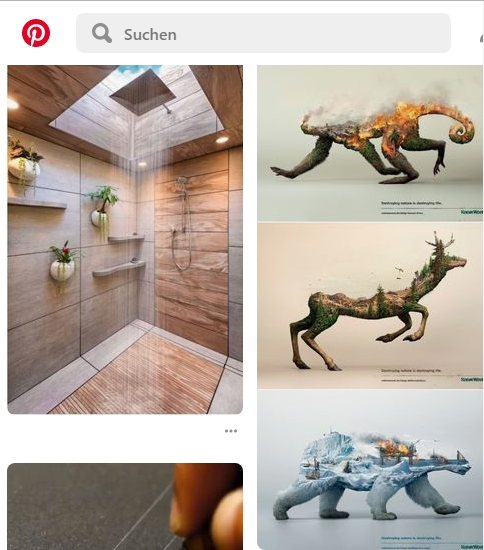
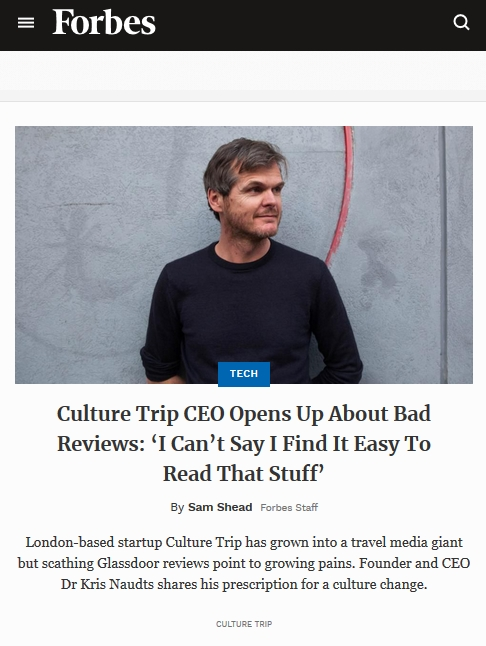
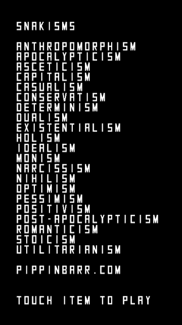
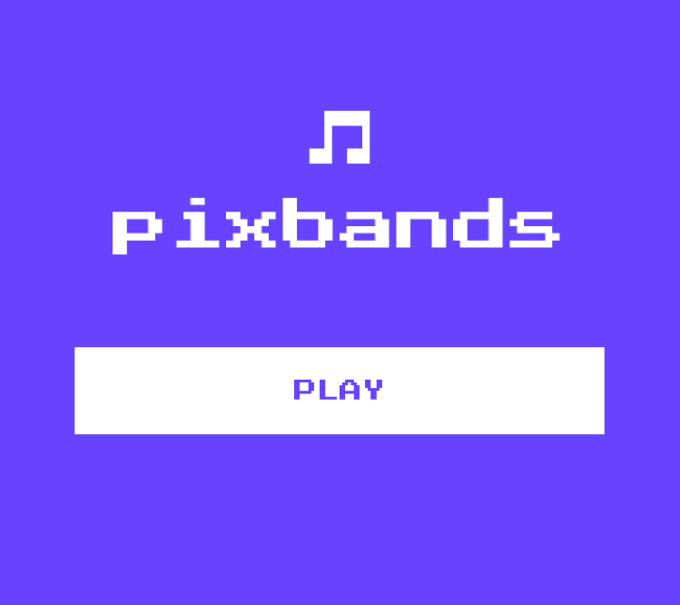

Dies ist eine Collection von pwa's
Daran wird noch gearbeitet....

<html lang="de">
  <head>
    
      <meta charset="utf-8">
    <meta http-equiv="X-UA-Compatible" content="IE=edge">
    <meta content="Dipl.-Ing. (FH) Guido Strasser" name="author">
 	<link rel="shortcut icon" type="image/x-icon" href="favicon.ico"> 
 	
    <meta name="viewport" content="width=device-width, initial-scale=1">
    <!-- Die 3 Meta-Tags oben *müssen* zuerst im head stehen; jeglicher sonstiger head-Inhalt muss *nach* diesen Tags kommen -->
    <title>PWA-Apps</title>
    <!-- Bootstrap -->
    <link href="bootstrap.min.css" rel="stylesheet">	
    
  
  <!-- Adsense -->
  

<!-- Start Cookie Plugin -->

 
<!-- Ende Cookie Plugin -->  
  </head>  
  <body>
  
   <!-- Fixierte Navbar -->
    <nav class="navbar navbar-inverse navbar-fixed-top" style="background-color: #334460; color: #FFFFFF; font-weight: bold; top: 15px;">
      

        

          <button type="button" class="navbar-toggle collapsed" data-toggle="collapse" data-target="#navbar" aria-expanded="false" aria-controls="navbar" style="color: #FFFFFF">
            Navigation ein-/ausblenden
            
            
            
          </button>PWA-Apps&nbsp;  

        

          <ul class="nav navbar-nav">
            <li><a href="index.html" style="color: #FFFFFF">Alle</a></li>                      
            <li class="dropdown">
              <a href="#" class="dropdown-toggle" data-toggle="dropdown" role="button" aria-haspopup="true" aria-expanded="false" style="color: #FFFFFF">PWA's sortieren</a>
              <ul class="dropdown-menu">
                <li><a href="games.html">Games</a></li>
                <li><a href="lernen.html">Lernen</a></li>
                <li><a href="lifestyle.html">Lifestyle</a></li>
				<li><a href="media.html">Media</a></li>
				<li><a href="tools.html">Tools</a></li>
				<li><a href="other.html">Other</a></li>
			</ul>			
            </li>
            <li class="dropdown">
              <a href="#" class="dropdown-toggle" data-toggle="dropdown" role="button" aria-haspopup="true" aria-expanded="false" style="color: #FFFFFF">Kontakt</a>
              <ul class="dropdown-menu">
				<li><a href="kontakt.html">Kontakt</a></li>
				<li><a href="agb.html">Unsere AGB</a></li>
			  </ul>
			</li>
			<li class="dropdown">
              <a href="#" class="dropdown-toggle" data-toggle="dropdown" role="button" aria-haspopup="true" aria-expanded="false" style="color: #FFFFFF">PWA's Infos</a>
              <ul class="dropdown-menu">
				<li><a href="pwa.html">Über PWA's</a></li>
				<li><a href="baupwa.html">PWA's bauen</a></li>
			  </ul>
			</li>
			<!-- <li><a href="baupwa.html" style="color: #FFFFFF">PWA's bauen</a></li> -->
			
          </ul>
        
<!--/.nav-collapse -->
      

    </nav>	
	
	

     

	<h3 style="position: relative; ">Progressive Web Apps (PWA's): Alle</h3>
	
      
<!-- FePwa -->
<ins class="adsbygoogle"
     style="display:block"
     data-ad-client="ca-pub-8397765882296907"
     data-ad-slot="5528952293"
     data-ad-format="auto"
     data-full-width-responsive="true"></ins>

	  
      

        

			
GlasbauEasy

		  <li class="list-group-item" style="text-align: left; font-size: medium">PWA zur Berechnung der Glasstatik nach DIN 18008 Teil 1 und Teil 2.</li>
		  

        

			
BMW

			
		  <li class="list-group-item" style="text-align: left; font-size: medium">Internetpräsenz des Automobilherstellers BWM.</li>
		  

		   <!-- Der clearfix wird nur für die benötigte Breite des Ansichtsfensters hinzugefügt -->
				

        

			
Pinterest

		  <li class="list-group-item" style="text-align: left; font-size: medium">Internetseite von Pinterest. Online-Pinnwand als Soziales Netzwerk.</li>
		  
		  
       

			
Forbes

		  <li class="list-group-item" style="text-align: left; font-size: medium">Internetpräsenz des Wirtschaftsmagazin Forbes. Eine englischsprachige Zeitschrift.</li>
		  
       
	  

	  
	  

        

			
NASA

		  <li class="list-group-item" style="text-align: left; font-size: medium">Internetpräsenz der NASA. 
		  Eine zivile US-Bundesbehörde für Raumfahrt und Flugwissenschaft.</li>
		  

        

			
Sparren Demo

		  <li class="list-group-item" style="text-align: left; font-size: medium">PWA zur Berechnung von waagrechten und geneigten Einfeldträgern: Sparren, Pfosen, etc.</li>
		  

		  <!-- Der clearfix wird nur für die benötigte Breite des Ansichtsfensters hinzugefügt -->
				

		  
        

			
Facebook

		  <li class="list-group-item" style="text-align: left; font-size: medium">Internetseite von Facebook. Soziales Netzwerk.</li>
		  
	
		  

			
Instagram

		  <li class="list-group-item" style="text-align: left; font-size: medium">Ein werbefinanzierter Onlinedienst zum Teilen von Fotos und Videos, der zu Facebook gehört.</li>
		  
		  
      

	  
	   

        

			
Geometrie

		  <li class="list-group-item" style="text-align: left; font-size: medium">PWA zur Berechnung von rechtwinkeligen Dreiecken, 
		  beliebigen Dreiecken und Kreisen.</li>
		  

        

			
Twitter

		  <li class="list-group-item" style="text-align: left; font-size: medium">Börsennotierter Betreiber des Mikroblogging-Dienstes Twitter.</li>
		  

		  <!-- Der clearfix wird nur für die benötigte Breite des Ansichtsfensters hinzugefügt -->
				

		  
        

			
Tinder

		  <li class="list-group-item" style="text-align: left; font-size: medium">Kommerzielle Mobile-Dating-App, zum kennenlernen von Menschen.</li>
		  
	
		  

			
Alibaba

		  <li class="list-group-item" style="text-align: left; font-size: medium">Online-Handelsplattform aus China.</li>
		  
		  
      

	  
	  

        

			
Trivago

		  <li class="list-group-item" style="text-align: left; font-size: medium">Hotel-Metasuche im Internet. Es können die Preise von Hotels, 
		  Hostels oder „Bed and Breakfast“-Unterkünften verglichen werden.</li>
		  

        

			
Uber

		  <li class="list-group-item" style="text-align: left; font-size: medium">Online-Vermittlungsdienste zur Personenbeförderung.</li>
		  

		  <!-- Der clearfix wird nur für die benötigte Breite des Ansichtsfensters hinzugefügt -->
				

		  
        

			
Financial Times

		  <li class="list-group-item" style="text-align: left; font-size: medium">Internetpräsenz der Zeitung Financial Times.</li>
		  
	
		  

			
Snakisms

		  <li class="list-group-item" style="text-align: left; font-size: medium">Snakisms ist eine Abwandlung des Snake Spiels,  
		  aber mit einer Auswahl an philosophischen Gesichtspunkten, aus denen man zu Beginn auswählen kann.</li>
		  
		  
      

	  
	  

        

			
Web Flap

		  <li class="list-group-item" style="text-align: left; font-size: medium">Online Geschicklichkeitsspiel.</li>
		  

        

			
Pacman

		  <li class="list-group-item" style="text-align: left; font-size: medium">Das bekannte Spiel online.</li>
		  

		  <!-- Der clearfix wird nur für die benötigte Breite des Ansichtsfensters hinzugefügt -->
				

		  
        

			
Tower Game

		  <li class="list-group-item" style="text-align: left; font-size: medium">PWA Spiel für Häuslebauer.</li>
		  
	
		  

			
Wetter App

		  <li class="list-group-item" style="text-align: left; font-size: medium">Wetter App für Browser.</li>
		  
		  
      

	  
	  

        

			
Code QR

		  <li class="list-group-item" style="text-align: left; font-size: medium">QR Scanner als PWA.</li>
		  

        

			
Notepad

		  <li class="list-group-item" style="text-align: left; font-size: medium">NotePad geht auch online.</li>
		  

		  <!-- Der clearfix wird nur für die benötigte Breite des Ansichtsfensters hinzugefügt -->
				

		  
        

			
Global Defense

		  <li class="list-group-item" style="text-align: left; font-size: medium">Intergalaktisches Verteidigungsspiel als PWA.</li>
		  
	
		  

			
Quiz Audio

		  <li class="list-group-item" style="text-align: left; font-size: medium">Quiz App für Musikliebhaber.</li>
		  
		  
      

	  
	  

        

			
Elements

		  <li class="list-group-item" style="text-align: left; font-size: medium">PWA über chemische Elemente.</li>
		  

        

			
Duolingo

		  <li class="list-group-item" style="text-align: left; font-size: medium">Web App zum Sprachen lernen.</li>
		  

		  <!-- Der clearfix wird nur für die benötigte Breite des Ansichtsfensters hinzugefügt -->
				

		  
        

			
Multicalc

		  <li class="list-group-item" style="text-align: left; font-size: medium">PWA Taschenrechner, Einheiten Umrechner und 2D Plot.</li>
		  
	
		  

			
Angular PWA Guide

		  <li class="list-group-item" style="text-align: left; font-size: medium">PWA erstellen mit Angular cli.</li>
		  
		  
      

	  
	  

        

			
Google Santa Tracker

		  <li class="list-group-item" style="text-align: left; font-size: medium">PWA zum Thema Weihnachtsmann.</li>
		  

        

			
Sudoku Spiel

		  <li class="list-group-item" style="text-align: left; font-size: medium">Sudoku das bekannte Spiel.</li>
		  

		  <!-- Der clearfix wird nur für die benötigte Breite des Ansichtsfensters hinzugefügt -->
				

		  
        

			
QR Code Scanner

		  <li class="list-group-item" style="text-align: left; font-size: medium">QR Code Scanner als PWA.</li>
		  
	
		  

			
Pencil

		  <li class="list-group-item" style="text-align: left; font-size: medium">Schreibprogramm als Web App.</li>
		  
		  
      

	  
	  

        

			
Kuranz

		  <li class="list-group-item" style="text-align: left; font-size: medium">Währungsumrechner als Web App.</li>
		  

        

			
Atom

		  <li class="list-group-item" style="text-align: left; font-size: medium">Web App zu Atomen.</li>
		  

		  <!-- Der clearfix wird nur für die benötigte Breite des Ansichtsfensters hinzugefügt -->
				

		  
        

			
Airbnb

		  <li class="list-group-item" style="text-align: left; font-size: medium">App zum finden von Untervermietungen, etc.</li>
		  
	
		  

			
Spotifiy

		  <li class="list-group-item" style="text-align: left; font-size: medium">App zum Musik anhören.</li>
		  
		  
      

	  
	  
	  
	  

     

	<h3 style="position: relative; ">Diese Seite befindet sich im Aufbau</h3>
      
Hier entsteht ein kostenfreies Portal für Progressive Web Apps (PWA's) !

	  
Stellen Sie ihre PWA in unser Portal.   
	  
	  <a style="text-decoration: none; color: rgb(204, 0, 0);" href="mailto:info@pwa-apps.de?subject=PWA Vorschlag, etc.&body=Bitte Name und Anschrift nicht vergessen.">
	  !! Kontaktieren Sie uns einfach !!</a> 

	  
		  
      

	  
      
	  
Für die in diesem Portal eingestellten PWA's 
	  sind die jeweiligen Softwarehersteller verantwortlich. 
	  

      
Änderungen an unserer Software, Dokumentation und Internetseite behalten wir uns vor. Wir nutzen Google Analytics. 
      Bitte beachten Sie diesbezüglich die Hinweise auf unserer Kontaktseite! &nbsp; 

      
	    
		
    <!-- jQuery (wird für Bootstrap JavaScript-Plugins benötigt) -->
    
    <!-- Binde alle kompilierten Plugins zusammen ein (wie hier unten) oder such dir einzelne Dateien nach Bedarf aus -->
    
	
	
  </body>
</html>
